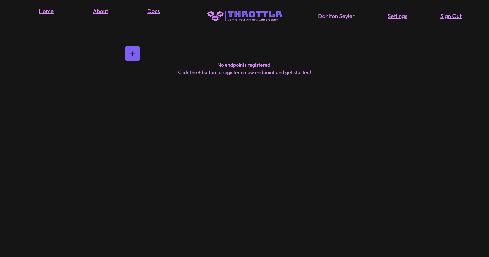

# Registering Endpoints

To get started, we need to create an endpoint. This is as simple as clicking the + button on the home page once you're signed in with an account.

<figure><figcaption></figcaption></figure>

Then fill out the endpoint that you are looking to throttle, the interval in which to throttle, and the max per interval. Then just hit register, your throttled link will be returned.

<figure><figcaption></figcaption></figure>

<figure><figcaption></figcaption></figure>

